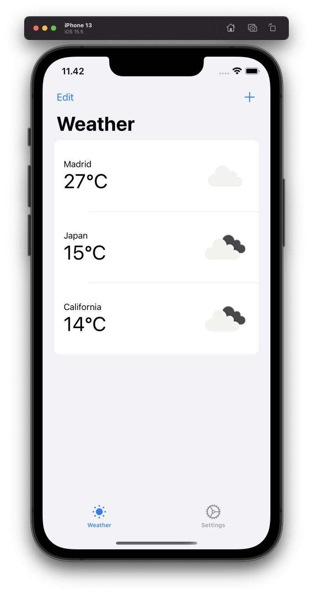

# Weather

iOS weather application using the OpenWeatherMap API.

## Screencast

https://youtu.be/iPWomIRjYmM



## Tech

Swift & SwiftUI. Also uses Alamofire for network requests.

## Local install

Assumes you have cocoapods already installed. If not, see https://cocoapods.org/

```bash
git clone https://github.com/mirorauhala/ios-weather-app
cd ios-weather-app
pod install # if on an arm64 processor, run the following "arch -x86_64 pod install"
open Weather.xcworkspace
```

Then build for a Simulator or a real device.
